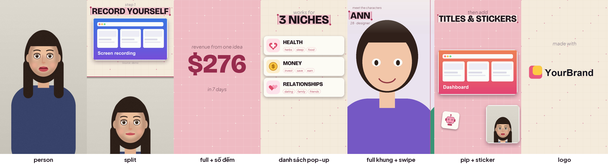

# pop-edit

**Skill cho [Claude Code](https://claude.ai/code): dựng video talking-head dọc 9:16 kiểu "typo-pop" bằng cách trò chuyện.**
Bạn đưa 1 video quay mặt + ảnh/clip minh họa; Claude lên kế hoạch, bạn duyệt, rồi nó dựng bằng code (Python + OpenCV + ffmpeg).


<sub>Video thử do chính skill dựng. Người nói và ảnh minh họa đều là hình vẽ tự sinh.</sub>

📘 **Hướng dẫn từng bước cho người mới (PDF, có hình): [`docs/HUONG-DAN.pdf`](docs/HUONG-DAN.pdf)**

## Có gì trong skill

| | |
|---|---|
| Bố cục | người nói full · **chia đôi** (minh họa trên, người dưới) · đồ họa full · **PiP** (người thu nhỏ ở góc) |
| Chữ | tiêu đề đậm có **ô chọn chữ**, chữ dẫn nghiêng, nền lưới + chấm |
| Phần tử | thẻ ảnh/clip bật lên · **danh sách pop-up theo lời nói** · số đếm lên · sticker vector · nhân vật full khung **swipe** · hàng thẻ chân dung · logo |
| Chuyển cảnh | tấm màu quét ngang |
| Âm thanh | **làm đều tiếng nói** · SFX tự tổng hợp (không bản quyền) · nhạc nền hạ khi có lời · khớp chuyển cảnh theo nhịp nhạc (tuỳ chọn) |
| Caption | bóc băng Whisper → Claude sửa lỗi → **tự đặt chỗ né mặt** (nhận diện mặt, ẩn lúc đổi bố cục) → kiểm tra lại video đã in |
| Màu | `be-hong` (mặc định), `xanh`, `tim-pastel`, hoặc tự đặt |

## Cài đặt

Cần: [Claude Code](https://claude.ai/code) (gói Pro/Max/Team/Enterprise), Python 3.10+, ffmpeg.

**Cách A — marketplace** (trong Claude Code):

```
/plugin marketplace add Annie-246/pop-edit
/plugin install pop-edit@pop-edit
```

**Cách B — chép tay:** tải repo, chép thư mục `skills/pop-edit` vào `~/.claude/skills/` (Windows: `C:\Users\<tên>\.claude\skills\`).

Lần đầu:

```bash
pip install -r skills/pop-edit/scripts/requirements.txt
python skills/pop-edit/scripts/popedit.py setup     # kiểm tra máy + tải font/model (1 lần)
```

Thử nhanh không cần tư liệu:

```bash
cd skills/pop-edit/examples/demo
python make_demo.py                                  # tự sinh video thử + project.json
python ../../scripts/popedit.py render project.json  # -> out/demo.mp4
```

## Dùng

Mở Claude Code trong thư mục có `source.mp4` (1080×1920) và `assets/`, rồi nói:

> Dựng giúp mình video này bằng skill pop-edit. Chưa dựng vội, đưa mình bảng kế hoạch giây → kiểu → hình gì.

Claude sẽ bóc băng, đề xuất kế hoạch, chờ bạn duyệt, viết `project.json`, xem thử bằng ảnh thu nhỏ, rồi render. Thêm phụ đề: *"Chèn phụ đề, né mặt, làm đều tiếng."*

Lệnh chạy tay: `python popedit.py -h` (`setup`, `new`, `transcribe`, `sheet`, `stills`, `render`, `captions`, `level`).

## Cấu trúc

```
.claude-plugin/        manifest để cài qua marketplace
skills/pop-edit/
  SKILL.md             hướng dẫn cho Claude (quy trình, luật cứng, sự cố)
  scripts/popedit/     engine, timeline, render, captions, faces, audio, sfx
  references/          phần tử, bố cục, caption, âm thanh, theme, checklist
  examples/demo/       bộ demo tự sinh
docs/                  HUONG-DAN.pdf + mã nguồn dựng PDF
```

## Giới hạn (nói thật)

- Chỉ nhận video **dọc 1080×1920**. Dựng chậm: khoảng 4–6 phút cho mỗi phút video (làm bằng CPU).
- Caption **không che mặt** nhưng có thể che cổ/ngực/tay. Nhận diện mặt có thể nhầm bàn tay hoặc bỏ sót mặt nghiêng; bước `--audit` chỉ đếm những mặt mà nó nhìn thấy.
- Âm thanh được **đo bằng máy**, không được nghe bằng tai — hãy nghe lại trước khi đăng.
- Ảnh/clip của người khác và nhạc nền: bạn chịu trách nhiệm về bản quyền; skill nhắc ghi nguồn nhưng không kiểm tra giúp bạn.

## Giấy phép

MIT (xem [LICENSE](LICENSE)). Font *Bricolage Grotesque* và *Plus Jakarta Sans* (OFL) và model nhận diện mặt *YuNet* của OpenCV (MIT) được tải về khi chạy `setup`, không nằm trong repo.
